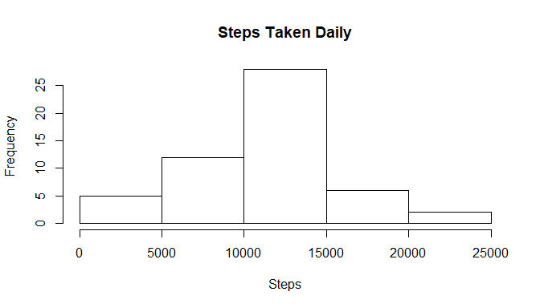
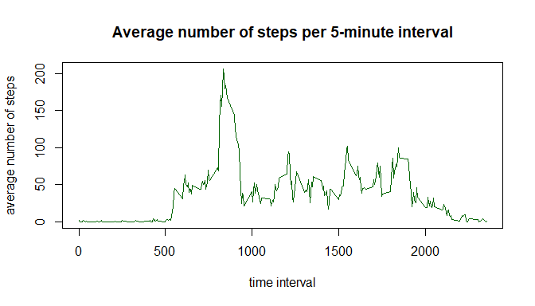

Options setup 


```r
knitr::opts_chunk$set(echo = TRUE)
```

Loading required packages


```r
library(plyr)
library(dplyr)
```

## Loading and preprocessing the data

Extract archive and read data into data table


```r
zipF <- "../RepData_PeerAssessment1/activity.zip"
outdir <- "."
unzip(zipF,exdir=outdir)
activity <- read.csv("activity.csv")
activity <- tbl_df(activity)

## convert 'date' value to the Date format
activity$date <- as.Date(as.character(activity$date), "%Y-%m-%d")
```

## What is mean total number of steps taken per day?

Let's look at the amount of steps taken per day


```r
stepsDay <- 
        activity %>% 
        group_by(date) %>% 
        summarize(steps.total = sum(steps))
```


```r
hist(stepsDay$steps.total, main = "Steps Taken Daily", xlab = "Steps")
```

<!-- -->


```r
meanStepsDay <- mean(stepsDay$steps.total, na.rm = T)
medianStepsDay <- median(stepsDay$steps.total, na.rm = T)
#disable scientific notation
options(scipen=999)
```

The __mean__ value for daily amount of steps is 10766.1886792 and __median__ is 10765

## What is the average daily activity pattern?


```r
stepsInt <- 
        activity %>% 
        group_by(interval) %>% 
        summarize(steps.int = mean(steps, na.rm = T))
```

Here's the plot visualizing average daily activity by 5-minute time intervals


```r
plot(stepsInt, type = "l", col = "dark green",
        xlab = "time interval", ylab = "average number of steps",
        main = "Average number of steps per 5-minute interval")
```

<!-- -->

Let's see what appears to be the most active time for a subject

```r
maxTime <- stepsInt[which.max(stepsInt$steps.int),1]

## format interval as proper time
maxTime <- paste0("0",maxTime)
maxTime <- format(strptime(maxTime, format="%H%M"), format = "%H:%M")
```

The subject is most active (does the highest amount of steps) on average at 08:35.

## Imputing missing values


```r
totalNA <- sum(is.na(activity$steps))
```

There are 2304 missing values in the dataset.

The presence of missing days may introduce bias into some calculations or summaries of the data. For filling them in we can replace missing values with the average value for the given time interval.


```r
## merge the data with average steps per interval
activityFull <- merge(activity, stepsInt, by = "interval")

## replace missing values
steps.na <- is.na(activityFull$steps)
activityFull$steps[steps.na] <- activityFull$steps.int[steps.na]

## remove extra column
activityFull <- activityFull[,-4]
```

Now, let's look again at daily activity


```r
stepsDayFull <- 
        activityFull %>% 
        group_by(date) %>% 
        summarize(steps.total = sum(steps))
```


```r
hist(stepsDayFull$steps.total, main = "Steps Taken Daily", xlab = "Steps")
```

<!-- -->


```r
meanStepsDayF <- mean(stepsDayFull$steps.total, na.rm = T)
medianStepsDayF <- median(stepsDayFull$steps.total, na.rm = T)
#disable scientific notation
options(scipen=999)
```

The __mean__ value for daily amount of steps after filling in missing values is 10766.1886792 (was 10766.1886792) and __median__ is 10766.1886792 (was 10765). 

## Are there differences in activity patterns between weekdays and weekends?

First, we need to create a new factor variable in the dataset with two levels - "weekday" and "weekend" indicating whether a given date is a weekday or weekend day.


```r
activityFull$day <- factor(sapply(activityFull$date, function(x){
        if (weekdays(x) == "Sunday" | weekdays(x) == "Saturday") {
                "weekend"
        }
        else{
                "weekday"
        }
}))
```

Aggregate data by amount of steps per interval deending on the weekday factor.


```r
stepsWeek <- 
        activityFull %>% 
        group_by(interval, day) %>% 
        summarize(steps = mean(steps))
```


```r
library(lattice)

xyplot(steps ~ interval | day, data = stepsWeek, type = "l", layout = c(1, 2), xlab = "Interval", ylab = "Number of steps")
```

<!-- -->


